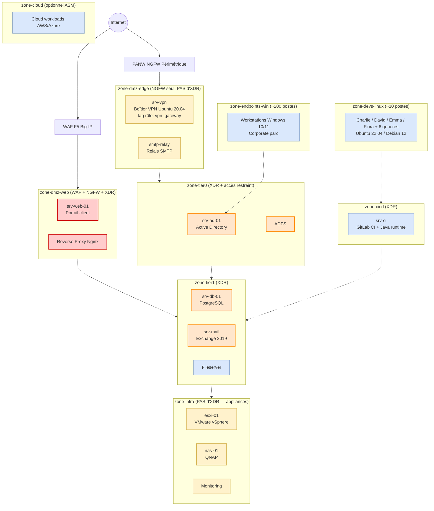

# Business Corp — Architecture réseau (Mermaid)

Diagramme de l'infrastructure fictive utilisée pour la démo. Version textuelle éditable (à convertir en draw.io ou capture PNG pour les slides).

## Vue d'ensemble

## Légende

- **Rouge** (`exposed`) : actifs exposés Internet — cibles principales du funnel règles 1, 2, 4, 6
- **Orange** (`critical`) : actifs Tier 0/1 critiques — porteurs de la Vulnerability Policy `POL-BusinessCorp-Tier0-Escalate`
- **Jaune** (`nocontrol`) : actifs sans Cortex XDR agent — matérialisent règle 3 "Maillon Faible"
- **Bleu** (`normal`) : actifs standards protégés par XDR

## Chiffres clés à afficher en slide

| Métrique | Valeur |
|----------|--------|
| Total actifs Business Corp | ~250 |
| Actifs "focus" (porteurs de vulns narratives) | 25 |
| Endpoints Windows corporate | ~200 |
| Postes dev Linux | ~10 |
| Zones logiques | 9 |
| Compensating controls déclarés | 4 (+ XDR auto) |
| Vulnerability Policies custom | 1 |
| Hero cases attendues après funnel | 6 |
| Vulnerabilités brutes avant funnel (Rapid7 + Cyberwatch) | ~2000+ (dont ~150 marquées "critique") |

## Conversion vers draw.io / slide

1. Coller le bloc Mermaid ci-dessus dans https://mermaid.live pour prévisualiser
2. Export SVG → import dans draw.io ou PowerPoint pour polissage graphique
3. Alternative : capture d'écran directe pour la slide "Acte 1 — Le problème"

## Notes de mise à jour

- Les serveurs `srv-web-01`, `srv-db-01`, `srv-mail`, `srv-vpn`, `esxi-01`, `nas-01`, `srv-ci` correspondent aux noms générés par `EXTRA_SERVER_SEED` des 2 sims
- Les personas utilisateurs Alice/Bob (Windows) et Charlie/David/Emma/Flora (Linux) proviennent de `xsiam-shared-personas`
- `srv-portail`, `srv-adfs-01`, `srv-print`, `smtp-relay` sont **injectés via `config/business-corp-config.yaml`** (extra_assets custom) — voir `runbook/02b`
- WAF F5, NGFW hardware, reverse proxy sont **des ajouts purement narratifs** (représentés dans XSIAM uniquement comme compensating controls attachés aux groupes d'assets, pas comme assets)
