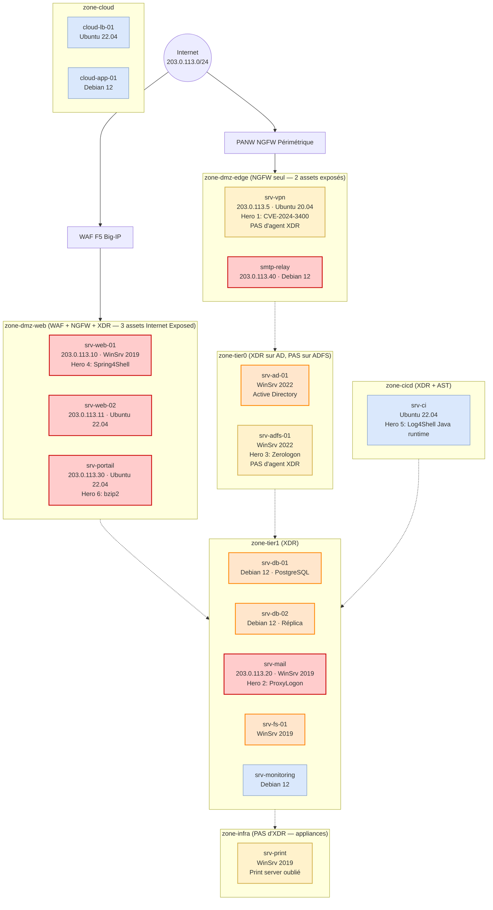

# Business Corp — Architecture réseau (v1 Rapid7 only)

Diagramme de l'infrastructure fictive utilisée pour la démo. Version textuelle éditable (à convertir en draw.io ou capture PNG pour les slides).

## Vue d'ensemble

```mermaid
flowchart TB
    Internet((Internet<br/>203.0.113.0/24)) --> WAF[WAF F5 Big-IP]
    Internet --> NGFW[PANW NGFW Périmétrique]

    subgraph DMZ_WEB["zone-dmz-web (WAF + NGFW + XDR — 3 assets Internet Exposed)"]
        Web1[srv-web-01<br/>203.0.113.10 · WinSrv 2019<br/>Hero 4: Spring4Shell]
        Web2[srv-web-02<br/>203.0.113.11 · Ubuntu 22.04]
        Portail[srv-portail<br/>203.0.113.30 · Ubuntu 22.04<br/>Hero 6: bzip2]
    end

    subgraph DMZ_EDGE["zone-dmz-edge (NGFW seul — 2 assets exposés)"]
        VPN[srv-vpn<br/>203.0.113.5 · Ubuntu 20.04<br/>Hero 1: CVE-2024-3400<br/>PAS d'agent XDR]
        SMTP[smtp-relay<br/>203.0.113.40 · Debian 12]
    end

    WAF --> DMZ_WEB
    NGFW --> DMZ_EDGE

    subgraph TIER0["zone-tier0 (XDR sur AD, PAS sur ADFS)"]
        AD[srv-ad-01<br/>WinSrv 2022<br/>Active Directory]
        ADFS[srv-adfs-01<br/>WinSrv 2022<br/>Hero 3: Zerologon<br/>PAS d'agent XDR]
    end

    subgraph TIER1["zone-tier1 (XDR)"]
        DB1[srv-db-01<br/>Debian 12 · PostgreSQL]
        DB2[srv-db-02<br/>Debian 12 · Réplica]
        Mail[srv-mail<br/>203.0.113.20 · WinSrv 2019<br/>Hero 2: ProxyLogon]
        FS[srv-fs-01<br/>WinSrv 2019]
        Mon[srv-monitoring<br/>Debian 12]
    end

    subgraph INFRA["zone-infra (PAS d'XDR — appliances)"]
        Print[srv-print<br/>WinSrv 2019<br/>Print server oublié]
    end

    subgraph CICD["zone-cicd (XDR + AST)"]
        CI[srv-ci<br/>Ubuntu 22.04<br/>Hero 5: Log4Shell Java runtime]
    end

    subgraph CLOUD["zone-cloud"]
        CloudLB[cloud-lb-01<br/>Ubuntu 22.04]
        CloudApp[cloud-app-01<br/>Debian 12]
    end

    DMZ_WEB -.-> TIER1
    DMZ_EDGE -.-> TIER0
    TIER0 -.-> TIER1
    TIER1 -.-> INFRA
    CICD -.-> TIER1

    classDef exposed fill:#ffcccc,stroke:#cc0000,stroke-width:2px
    classDef critical fill:#ffe6cc,stroke:#ff8800,stroke-width:2px
    classDef nocontrol fill:#fff2cc,stroke:#d6b656,stroke-width:2px
    classDef normal fill:#dae8fc,stroke:#6c8ebf,stroke-width:1px

    class Web1,Web2,Portail,VPN,SMTP,Mail exposed
    class AD,ADFS,DB1,DB2,FS critical
    class Print,VPN,ADFS nocontrol
    class CI,Mon,CloudLB,CloudApp normal
```

## Légende

- **Rouge** (`exposed`) : actifs avec IP publique — cibles principales des règles R1, R2, R4, R7
- **Orange** (`critical`) : actifs Tier 0/1 critiques — porteurs de la Vulnerability Policy R3 (Angle mort interne)
- **Jaune** (`nocontrol`) : actifs sans Cortex XDR agent — matérialisent R3 "Maillon Faible" (ADFS, print) ou R2 "Urgence périmètre" (VPN)
- **Bleu** (`normal`) : actifs standards protégés par XDR

## Chiffres clés à afficher en slide

| Métrique | Valeur |
|----------|--------|
| Total actifs Business Corp (focus) | 16 |
| Actifs "personas" (users) supplémentaires | ~6 (hostname court) |
| Zones logiques | 7 (dmz-web, dmz-edge, tier0, tier1, infra, cicd, cloud) |
| Actifs avec IP publique (Internet Exposed) | 6 |
| Compensating controls déclarés | 4 (WAF F5 + PANW NGFW + XDR Windows + XDR Linux) |
| Vulnerability Policies R1-R8 | 8 (CVRS-centric) |
| Hero cases attendues après funnel | 6 |
| Vulnerabilités brutes avant funnel (Rapid7) | ~150-200 |
| Cases actionnables après funnel | 6-15 |

## Conversion vers draw.io / slide

1. Coller le bloc Mermaid ci-dessus dans https://mermaid.live pour prévisualiser
2. Export SVG → import dans draw.io ou PowerPoint pour polissage graphique
3. Alternative : capture d'écran directe pour la slide "Acte 1 — Le problème"

## Notes de mise à jour

- Les serveurs `srv-web-01/02`, `srv-db-01/02`, `srv-mail`, `srv-ad-01`, `srv-fs-01`, `srv-vpn`, `srv-monitoring`, `srv-ci`, `cloud-lb-01`, `cloud-app-01` correspondent aux noms générés par `EXTRA_SERVER_SEED` natif du sim Rapid7
- Les personas utilisateurs Alice/Bob (Windows) et Charlie/David/Emma/Flora (Linux) proviennent de `xsiam-shared-personas` mais ont un hostname court sans `.business.org` — non représentées dans le diagramme
- `srv-portail`, `srv-adfs-01`, `srv-print`, `smtp-relay` sont **injectés via `config/business-corp-config.yaml`** (extra_assets custom) — voir `runbook/02b`
- Les IPs publiques (203.0.113.0/24) sont injectées via le YAML `additional_public_ips` et enrichies dans `addresses` par le bloc 6 du patch `apply-patches.py`
- WAF F5 et NGFW hardware sont **des ajouts purement narratifs** (représentés dans XSIAM uniquement comme compensating controls attachés aux groupes d'assets, pas comme assets)
- **Cyberwatch retiré en v1** — les assets exclusifs Cyberwatch (esxi-01, nas-01) ne sont plus représentés
